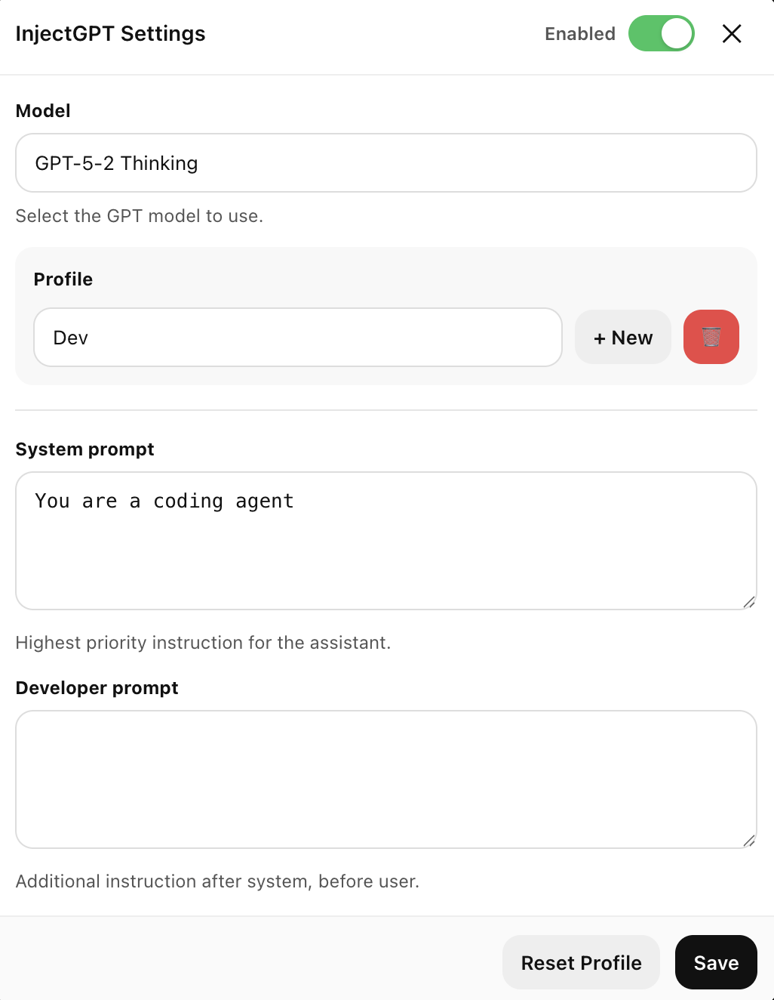

# InjectGPT

🎥 **Demo Video**  

> ▶️ Click the image to watch the demo

## Chromestore Link
[Chrome Extension](https://chromewebstore.google.com/detail/injectgpt/aciknfjmhejepfklbedciieikagjohnh)

---

InjectGPT is a Chrome extension that injects a **custom system prompt**, **developer prompt**, and **model selection** directly into ChatGPT requests.

Once configured, it **always uses your chosen settings** for every conversation.

For example, you can define a new system prompt and ChatGPT will permanently behave according to it.

---

## How It Works

The extension intercepts all `/conversation` requests at the **network level**, replacing the **model**, **system prompt**, and **developer prompt** with your current settings *before* they reach OpenAI’s servers.

---

## Features

- **Model selection** – switch between `gpt-5-2`, `gpt-5-2-thinking`, and other models  
- **Custom system prompt** – define how the AI behaves  
- **Custom developer prompt** – inject additional instructions after user messages  
- **Settings persistence** – preferences are saved in `localStorage`

---

## Installation

1. Clone or download this repository  
2. Open `chrome://extensions`  
3. Enable **Developer mode**  
4. Click **Load unpacked**  
5. Select the extension folder  

---

## Usage

1. Go to https://chatgpt.com  
2. Press **InjectGPT Settings**  
3. Change model and prompts  
4. Start chatting  

---

## Files

- `manifest.json` – extension configuration  
- `content.js` – UI injection and settings management  
- `injector.js` – network-level request interception  
- `styles.css` – dark theme styling  

---

## Note

⚠️ **For educational purposes only.**
